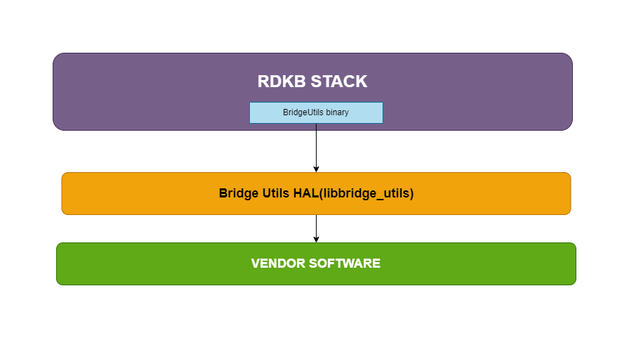

# BRIDGE UTIL HAL Documentation

# Version and Version History

1.0.0 Initial Revision covers existing BRIDGE UTIL HAL implementation.

## Acronyms

- `HAL` \- Hardware Abstraction Layer
- `RDK-B` \- Reference Design Kit for Broadband Devices
- `OEM` \- Original Equipment Manufacture

# Description
The diagram below describes a high-level software architecture of the BRIDGE UTIL HAL module stack. 

BRIDGE UTIL HAL is for an abstraction layer, implemented to interact with vendor software for setting the specific details such as modes, connection enable/disable, QoS configuration, Ipv4 config. etc.

# Component Runtime Execution Requirements

## Initialization and Startup

Below Initialization API's provide opportunity for the HAL code to initialize the appropriate DB's, start threads etc. 

Bridge Util will invoke below API's while executing operations on bridges. Vendor should handle any required operations in the API's

1. HandlePreConfigVendor()
1. HandlePostConfigVendor()

RDK BRIDGE UTIL HAL doesn't mandates any predefined requirements for implementation of these API's. it is upto the 
3rd party vendors to handle it appropriately to meet operational requirements.

For Independent API's 3rd party implementation is expected to work without any prerequisties.

Failure to meet these requirements will likely result in undefined and unexpected behaviour.

## Threading Model

BRIDGE UTIL HAL is not thread safe, any module which is invoking the BRIDGE UTIL HAL api should ensure calls are made in a thread safe manner.

Different 3rd party vendors allowed to create internal threads to meet the operational requirements. In this case 3rd party implementations
should be responsible to synchronize between the calls, events and cleanup the thread.

## Memory Model

BRIDGE UTIL HAL client module is responsible to allocate and deallocate memory for necessary API's as specified in API Documentation.

Different 3rd party vendors allowed to allocate memory for internal operational requirements. In this case 3rd party implementations
should be responsible to deallocate internally.

## Power Management Requirements

The BRIDGE UTIL HAL is not involved in any of the power management operation.
Any power management state transitions MUST not affect the operation of the BRIDGE UTIL HAL. 

## Asynchronous Notification Model
None

## Blocking calls

BRIDGE UTIL HAL API's are expected to work synchronously and should complete within a time period commensurate with the complexity of the operation and in accordance with any relevant specification. 
Any calls that can fail due to the lack of a response should have a timeout period in accordance with any relevant documentation.

## Internal Error Handling

All the BRIDGE UTIL HAL API's should return error synchronously as a return argument. HAL is responsible to handle system errors(e.g. out of memory) internally.

## Persistence Model

There is no requirement for HAL to persist any setting information. Application/Client is responsible to persist any settings related to their implementation.

# Nonfunctional requirements

Following non functional requirement should be supported by the BRIDGE UTIL HAL component.

## Logging and debugging requirements

BRIDGE UTIL HAL component should log all the error and critical informative messages which helps to debug/triage the issues and understand the functional flow of the system.

## Memory and performance requirements

Make sure BRIDGE UTIL HAL is not contributing more to memory and CPU utilization while performing normal operations and Commensurate with the operation required.

## Quality Control

BRIDGE UTIL HAL implementation should pass Coverity, Black duck scan, valgrind checks without any issue.

There should not be any memory leaks/corruption introduced by HAL and underneath 3rd party software implementation.

## Licensing

BRIDGE UTIL HAL implementation is expected to released under the Apache License. 

## Build Requirements

BRIDGE UTIL HAL source code should be build under Linux Yocto environment and should be delivered as a shared library libhal_wan.so
  

## Variability Management

Any new API introduced should be implemented by all the 3rd party module and RDK generic code should be compatible with specific version of BRIDGE UTIL HAL software

## WAN or Product Customization

None

## Interface API Documentation

Covered as per Doxygen documentations.

## Theory of operation and key concepts

Covered as per "Description" sections in the API documentation.

All HAL function prototypes and datatype definitions are available in bridge_util_hal.h file.
    
     1. Components/Process must include bridge_util_hal.h to make use of BRIDGE UTIL HAL capabilities.
     2. Components/Process should add linker dependency for libbridge_utils.la .

### UML Diagrams

#### Sequence Diagram

