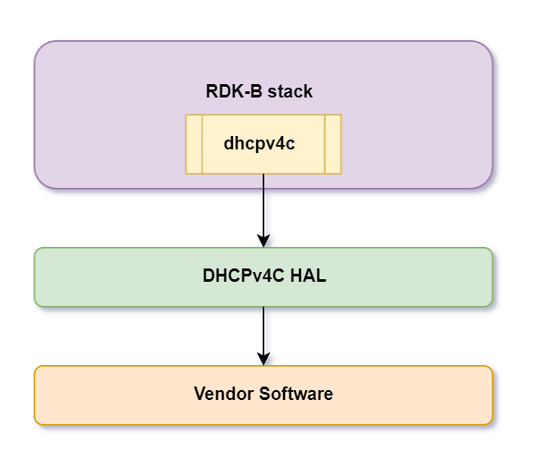
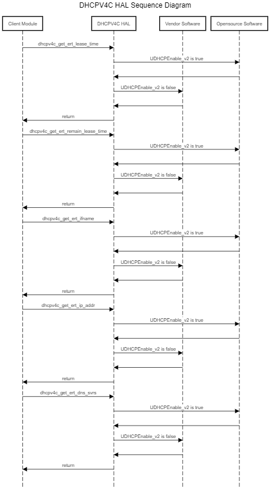

@mainpage

# DHCPv4C HAL Documentation

# Version and Version History

1.0.0 Initial Revision covers existing DHCPv4C HAL implementation.

## Acronyms

- `HAL` \- Hardware Abstraction Layer
- `RDK-B` \- Reference Design Kit for Broadband Devices
- `OEM` \- Original Equipment Manufacture

# Description
The diagram below describes a high-level software architecture of the DHCPv4C HAL module stack.

DHCPv4C HAL is an abstraction layer, implemented to interact with the underlying software through a standard set of APIs to get offered lease time, remaining lease time, remaining time to renew, DHCP State etc.
This HAL layer is intended to be a common HAL,should be usable by any Ccspcomponents or Processes.

# Component Runtime Execution Requirements

## Initialization and Startup

If syscfg parameter "UDHCPEnable_v2" is true then opensource dhcpv4c APIs will be used.
If syscfg parameter "UDHCPEnable_v2" is flase then proprietary dhcpv4c APIs will be used.

RDK DHCPv4C HAL doesn't mandates any predefined requirements for implementation of these API's. it is upto the
3rd party vendors to handle it appropriately to meet operational requirements.

For Independent API's 3rd party implementation is expected to work without any prerequisties.

Failure to meet these requirements will likely result in undefined and unexpected behaviour.

## Threading Model

DHCPv4C HAL is not thread safe, any module which is invoking the DHCPv4C HAL api should ensure calls are made in a thread safe manner.

Different 3rd party vendors allowed to create internal threads to meet the operational requirements. In this case 3rd party implementations
should be responsible to synchronize between the calls, events and cleanup the thread.

## Memory Model

DHCPv4C HAL client module is responsible to allocate and deallocate memory for necessary API's as specified in API Documentation.

Different 3rd party vendors allowed to allocate memory for internal operational requirements. In this case 3rd party implementations
should be responsible to deallocate internally.

## Power Management Requirements

The DHCPv4C HAL is not involved in any of the power management operation.
Any power management state transitions MUST not affect the operation of the DHCPv4C HAL.

## Asynchronous Notification Model
None

## Blocking calls

DHCPv4C HAL API's are expected to work synchronously and should complete within a time period commensurate with the complexity of the operation and in accordance with any relevant specification.
Any calls that can fail due to the lack of a response should have a timeout period in accordance with any relevant documentation.

## Internal Error Handling

All the DHCPv4C HAL API's should return error synchronously as a return argument. HAL is responsible to handle system errors(e.g. out of memory) internally.

## Persistence Model

There is no requirement for HAL to persist any setting information. Application/Client is responsible to persist any settings related to their implementation.

# Nonfunctional requirements

Following non functional requirement should be supported by the DHCPv4C HAL component.

## Logging and debugging requirements

DHCPv4C HAL component should log all the error and critical informative messages which helps to debug/triage the issues and understand the functional flow of the system.

## Memory and performance requirements

Make sure DHCPv4C HAL is not contributing more to memory and CPU utilization while performing normal operations and Commensurate with the operation required.

## Quality Control

DHCPv4C HAL implementation should pass Coverity, Black duck scan, valgrind checks without any issue.

There should not be any memory leaks/corruption introduced by HAL and underneath 3rd party software implementation.

## Licensing

DHCPv4C HAL implementation is expected to released under the Apache License.

## Build Requirements

DHCPv4C HAL source code should be build under Linux Yocto environment and should be delivered as a shared library libapi_dhcpv4c.so

## Variability Management

Any new API introduced should be implemented by all the 3rd party module and RDK generic code should be compatible with specific version of DHCPv4C HAL software

## DHCPv4C or Product Customization

None

## Interface API Documentation

All HAL function prototypes and datatype definitions are available in dhcp4cApi.h, dhcpv4c_api.h files.

     1. Components/Process must include dhcp4cApi.h, dhcpv4c_api.h to make use of DHCPv4C hal capabilities.
     2. Components/Process should add linker dependency for libapi_dhcpv4c.

## Theory of operation and key concepts

Covered as per "Description" sections in the API documentation.

### UML Diagrams

#### Sequence Diagram

