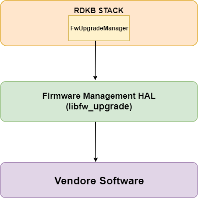

@mainpage

# Firmware Management HAL Documentation

# Version and Version History

1.0.0 Initial Revision covers existing  Firmware Management HAL implementation.

## Acronyms

- `HAL` \- Hardware Abstraction Layer
- `RDK-B` \- Reference Design Kit for Broadband Devices
- `OEM` \- Original Equipment Manufacture

# Description
The diagram below describes a high-level software architecture of the  Firmware Management HAL module stack. 

Firmware Management HAL is an abstraction layer implemented to abstract the underlying Firmware Management hardware and interact with the underlying software through a standard set of APIs to download the firmware for the CPE devices.Inaddition to that downloading status also can be known through the APIs.
 
# Component Runtime Execution Requirements

## Initialization and Startup

The below mentioned APIs will be used to set the download url,download the firmware from server, commit the firmware on the bank and set the reboot status from the Firmware Management HAL layers/code. Firmware Management HAL client module is expected to be implemented in the following order inorder to work properly.

1. fwupgrade_hal_set_download_url
2. fwupgrade_hal_set_download_interface
3. fwupgrade_hal_download
4. fwupgrade_hal_reboot_ready
5. fwupgrade_hal_download_reboot_now

The following API will update the firmware and Factory reset the device in a single reboot.
1. fwupgrade_hal_update_and_factoryreset

RDK Firmware Management HAL doesn't mandates any predefined requirements for implementation of these API's. it is upto the 
3rd party vendors to handle it appropriately to meet operational requirements.

Failure to meet these requirements will likely result in undefined and unexpected behaviour.

## Threading Model

Firmware Management HAL is not thread safe, any module which is invoking the Firmware Management HAL api should ensure calls are made in a thread safe manner.

Different 3rd party vendors allowed to create internal threads to  meet the operational requirements. In this case 3rd party implementations should be responsible to synchronize between the calls, events and cleanup the thread.

## Process Model

## Memory Model

Firmware Management HAL client module is responsible to allocate and deallocate memory for necessary APIs as specified in API documentation.
Different 3rd party vendors allowed to allocate memory for internal operational requirements. In this case 3rd party implementations should be responsible to deallocate internally.

## Power Management Requirements

The Firmware Management HAL is not involved in any of the power management operation.
Any power management state transitions MUST not affect the operation of the Firmware Management HAL.

## Asynchronous Notification Model

None

## Blocking calls

Firmware Management HAL APIs are expected to work synchronously and should complete within a time period commensurate with the complexity of the operation and in accordance with any relevant Firmware Management specification. Any calls that can fail due to the lack of a response from connected device should have a timeout period in accordance with any relevant documentation. 

## Internal Error Handling

All the Firmware Management HAL APIs should return error synchronously as a return argument. HAL is responsible to handle system errors(e.g. out of memory) internally.

## Persistence Model

There is no requirement for HAL to persist any setting information. Application/Client is responsible to persist any settings related to Firmware Management feature.

# Nonfunctional requirements

Following non functional requirement should be supported by the Firmware Management HAL component.

## Logging and debugging requirements

Firmware Management HAL component should log all the error and critical informative messages which helps to debug/triage the issues and understand the functional flow of the system.

## Memory and performance requirements

Make sure Firmware Management HAL is not contributing more to memory and CPU utilization while performing normal Firmware Management operations. Commensurate with the operation required.

## Quality Control

Firmware Management HAL implementation should pass Coverity, Black duck scan, valgrind checks without any issue.

There should not be any memory leaks/corruption introduced by HAL and underneath 3rd party software implementation.

## Licensing

Firmware Management HAL implementation is expected to released under the Apache License. 

## Build Requirements

Firmware Management HAL source code should be build under Linux Yocto environment and should be delivered as a library libfw_upgrade
  

## Variability Management

Any new API introduced should be implemented by all the 3rd party module and RDK generic code should be compatible with specific version of Firmware Management HAL software

## Platform or Product Customization

None

# Interface API Documentation

Covered as per Doxygen documentations.

## Theory of operation and key concepts

Covered as per "Description" sections.
All HAL function prototypes and datatype definitions are available in fwupgrade_hal.h file.
  1.  Components/Processes must include fwupgrade_hal.h to make use of Firmware Management HAL capabilities
  2.  Components/Processes must include linker dependency for libhal platform.

### UML Diagrams

#### Sequence Diagram

